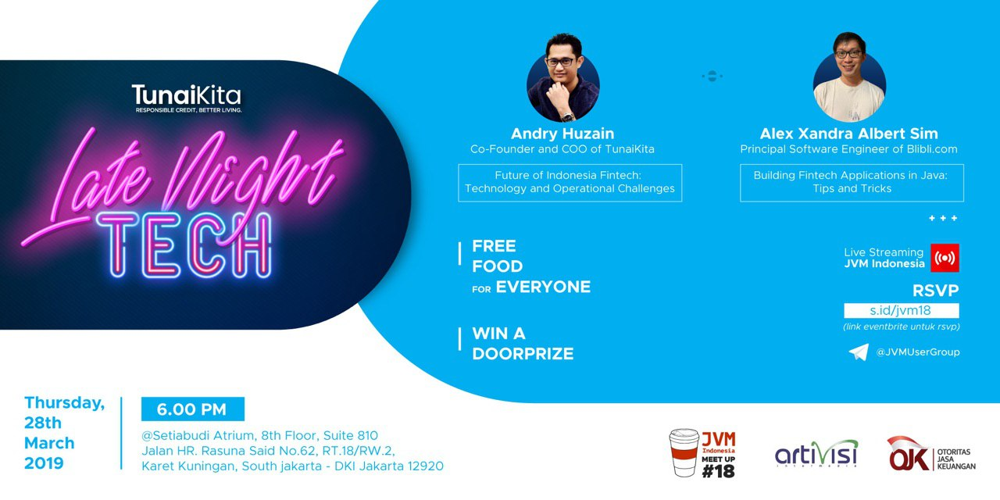

# JVM-Meetup-18
Summarize from JVM Meetup #18 @ TunaiKita

PT Digital Tunai Kita - Fintech P2P Lending

62 Jalan Haji R. Rasuna Said

RT.6/RW.7, Kuningan, Karet Kuningan

Kecamatan Setiabudi, Daerah Khusus Ibukota Jakarta 12920 

Speaker :

1. Andry Huzain (Co-Founder & COO TunaiKita) : "Future of Indonesia Fintech : Technologgy & Operation Challenge".
2. Alex Xandra Alber Sim (Principal RnD Blibli) : "Building Fintech Application in Java: Tips & Tricks".

Ayo join JVM User Group di telegram untuk diskusi lebih lanjut.

Join Us : [@JVMUserGroup](https://t.me/JVMUserGroup)

Like & Follow Instagram : [JVM Indonesia](https://www.instagram.com/jvmindonesia/)

Like & Follow : [JVM Developer ID](https://www.facebook.com/JVMDeveloperID/)

Subscribe : [JVM Indonesia](https://www.youtube.com/channel/UCXwXmQEQySqhqAMmys4N56w)